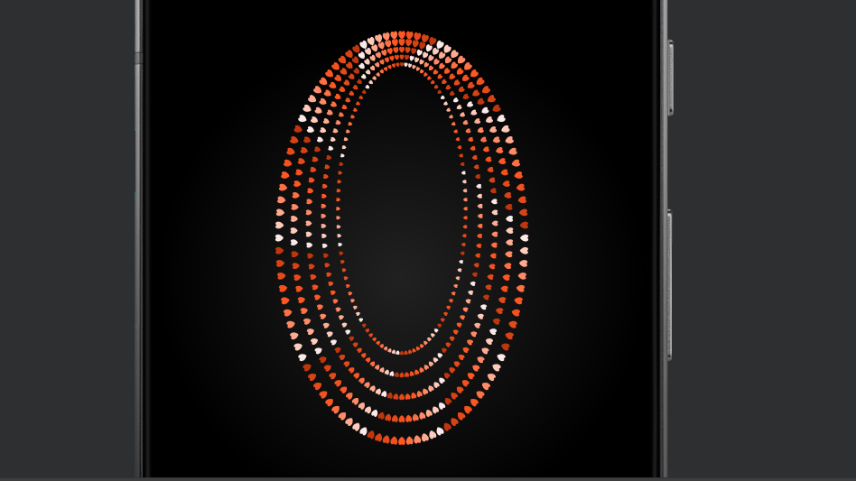

# Nangah Amandine's Generative HeARTs

##Welcome to my Generative Art, created with Dart (Flutter). 
This project is a celebration of the spirit of love, infused with the essence and vibrancy of African art. 
It is a visual symphony that captures the enigmatic allure of the continent's cultural heritage while symbolizing the universal language of love through its heart motifs.

Crafted with precision and creativity, this art piece leverages the powerful rendering capabilities of Flutter to create an illusion of depth and movement. 
The concentric heart patterns, set against a deep, contrasting background, invite viewers into a journey of mystery and satisfaction. 
The intentional color choices and the play of shadows serve to not only draw the eye but also to create a rhythmic pattern that pulsates with life and intensity. 
This piece is more than just an application; it's an homage to the rich tapestry of African artistry and a testament to the enduring symbol of love.

